## Docker 客户端
docker 客户端非常简单 ,我们可以直接输入 docker 命令来查看到 Docker 客户端的所有命令选项。

    docker

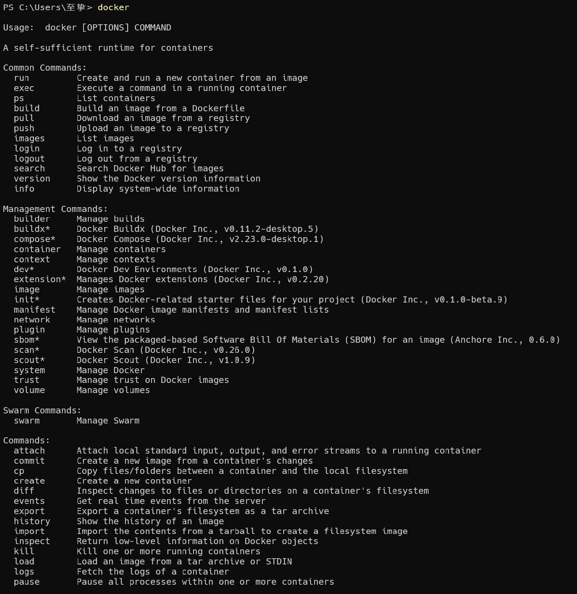

可以通过命令 `docker command --help` 更深入的了解指定的 Docker 命令使用方法。

例如我们要查看 docker stats 指令的具体使用方法：

    docker stats --help

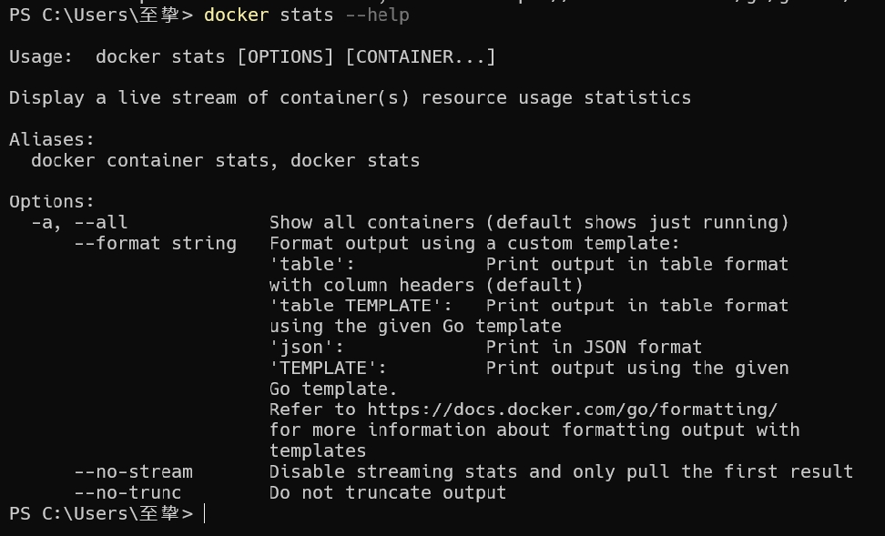

## 容器使用
### 获取镜像
如果我们本地没有 ubuntu 镜像，我们可以使用 docker pull 命令来载入 ubuntu 镜像：

    docker pull ubuntu

### 启动容器
以下命令使用 ubuntu 镜像启动一个容器，参数为以命令行模式进入该容器：

    docker run -it ubuntu /bin/bash

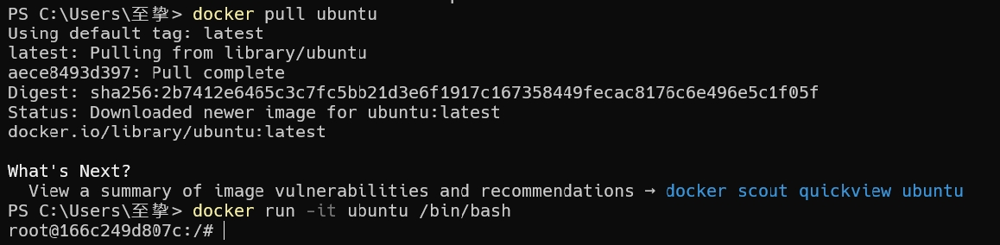

参数说明：
- `-i`: 交互式操作。
- `-t`: 终端。
- `ubuntu`: ubuntu 镜像。
- `/bin/bash`：放在镜像名后的是命令，这里我们希望有个交互式 Shell，因此用的是 /bin/bash。

要退出终端，直接输入 exit:

    exit

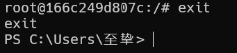

### 启动已停止运行的容器
查看所有的容器命令如下：

    docker ps -a

使用 docker start 启动一个已停止的容器：

    docker start 166c249d807c 

### 后台运行
在大部分的场景下，我们希望 docker 的服务是在后台运行的，我们可以过 -d 指定容器的运行模式。

    docker run -itd --name ubuntu-test ubuntu /bin/bash

> 注：加了 -d 参数默认不会进入容器，想要进入容器需要使用指令 docker exec（下面会介绍到）。

### 停止一个容器
停止容器的命令如下：

    docker stop <容器 ID>

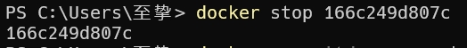

停止的容器可以通过 docker restart 重启：

    docker restart <容器 ID>

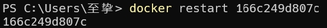

### 进入容器
在使用 -d 参数时，容器启动后会进入后台。此时想要进入容器，可以通过以下指令进入：
- `docker attach`
- `docker exec`：推荐大家使用 `docker exec` 命令，因为此命令会退出容器终端，但不会导致容器的停止。

#### attach 命令
下面演示了使用 docker attach 命令。

    docker attach 166c249d807c 

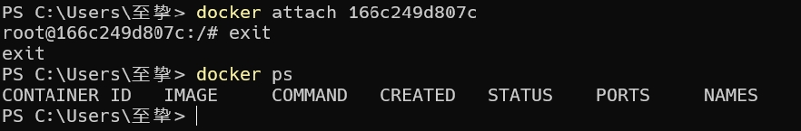

> 注意： 如果从这个容器退出，会导致容器的停止。

#### exec 命令
下面演示了使用 docker exec 命令。

    docker exec -it 166c249d807c /bin/bash

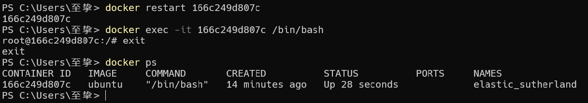

> 注意： 如果从这个容器退出，容器不会停止，这就是为什么推荐大家使用 docker exec 的原因。

### 导出和导入容器
#### 导出容器
如果要导出本地某个容器，可以使用 docker export 命令。

    docker export 166c249d807c > ubuntu.tar

导出容器 1e560fca3906 快照到本地文件 ubuntu.tar。

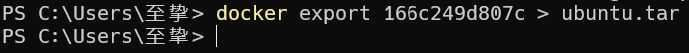

> 相对路径为当前用户目录

#### 导入容器快照
可以使用 docker import 从容器快照文件中再导入为镜像，以下实例将快照文件 ubuntu.tar 导入到镜像 `test/ubuntu:v1`:

    cat ubuntu.tar | docker import - test/ubuntu:v1

> TODO:这里报错了，暂时没找到原因

此外，也可以通过指定 URL 或者某个目录来导入，例如：

    docker import http://example.com/exampleimage.tgz example/imagerepo

#### 删除容器
删除容器使用 docker rm 命令：

    docker rm -f 166c249d807c

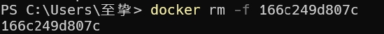

下面的命令可以清理掉所有处于终止状态的容器。

    docker container prune

### 运行一个 web 应用
前面我们运行的容器并没有一些什么特别的用处。

接下来让我们尝试使用 docker 构建一个 web 应用程序。

我们将在docker容器中运行一个 Python Flask 应用来运行一个web应用。

    docker pull training/webapp  # 载入镜像
    docker run -d -P training/webapp python app.py

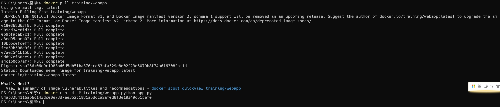

参数说明:
- `-d`:让容器在后台运行。
- `-P`:将容器内部使用的网络端口随机映射到我们使用的主机上。

### 查看 WEB 应用容器
使用 docker ps 来查看我们正在运行的容器：

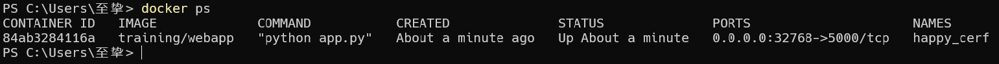

这里多了端口信息。

    PORTS
    0.0.0.0:32768->5000/tcp

Docker 开放了 5000 端口（默认 Python Flask 端口）映射到主机端口 32768 上。

这时我们可以通过浏览器访问WEB应用

我们也可以通过 -p 参数来设置不一样的端口：

    docker run -d -p 8000:5000 training/webapp python app.py

`docker ps`查看正在运行的容器

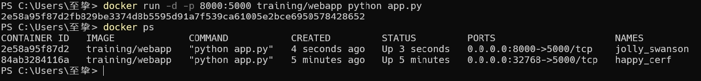

容器内部的 5000 端口映射到我们本地主机的 8000 端口上。

