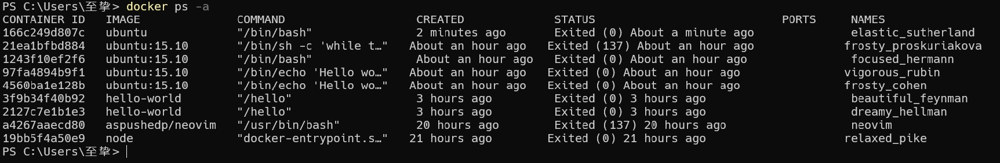
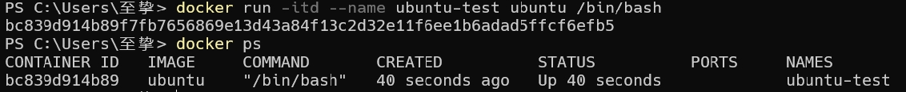

## Docker 客户端
docker 客户端非常简单 ,我们可以直接输入 docker 命令来查看到 Docker 客户端的所有命令选项。

    docker

可以通过命令 `docker command --help` 更深入的了解指定的 Docker 命令使用方法。

例如我们要查看 docker stats 指令的具体使用方法：

    docker stats --help

## 容器使用
### 获取镜像
如果我们本地没有 ubuntu 镜像，我们可以使用 docker pull 命令来载入 ubuntu 镜像：

    docker pull ubuntu

### 启动容器
以下命令使用 ubuntu 镜像启动一个容器，参数为以命令行模式进入该容器：

    docker run -it ubuntu /bin/bash

参数说明：
- `-i`: 交互式操作。
- `-t`: 终端。
- `ubuntu`: ubuntu 镜像。
- `/bin/bash`：放在镜像名后的是命令，这里我们希望有个交互式 Shell，因此用的是 /bin/bash。

要退出终端，直接输入 exit:

    exit

### 启动已停止运行的容器
查看所有的容器命令如下：

    docker ps -a

使用 docker start 启动一个已停止的容器：

    docker start 166c249d807c 

### 后台运行
在大部分的场景下，我们希望 docker 的服务是在后台运行的，我们可以过 -d 指定容器的运行模式。

    docker run -itd --name ubuntu-test ubuntu /bin/bash

> 注：加了 -d 参数默认不会进入容器，想要进入容器需要使用指令 docker exec（下面会介绍到）。

### 停止一个容器
停止容器的命令如下：

    docker stop <容器 ID>

停止的容器可以通过 docker restart 重启：

    docker restart <容器 ID>

### 进入容器
在使用 -d 参数时，容器启动后会进入后台。此时想要进入容器，可以通过以下指令进入：
- `docker attach`
- `docker exec`：推荐大家使用 `docker exec` 命令，因为此命令会退出容器终端，但不会导致容器的停止。

#### attach 命令
下面演示了使用 docker attach 命令。

    docker attach 1e560fca3906 

> 注意： 如果从这个容器退出，会导致容器的停止。

#### exec 命令
下面演示了使用 docker exec 命令。

    docker exec -it 243c32535da7 /bin/bash

> 注意： 如果从这个容器退出，容器不会停止，这就是为什么推荐大家使用 docker exec 的原因。

