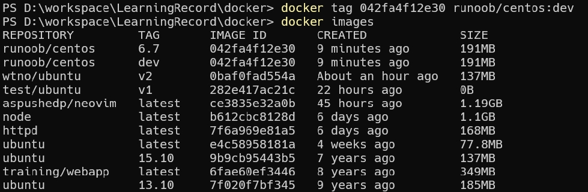

# Docker 镜像使用
当运行容器时，使用的镜像如果在本地中不存在，docker 就会自动从 docker 镜像仓库中下载，默认是从 Docker Hub 公共镜像源下载。

下面我们来学习：
1. 管理和使用本地 Docker 主机镜像
2. 创建镜像

## 列出镜像列表
我们可以使用 docker images 来列出本地主机上的镜像。

各个选项说明:
- `REPOSITORY：表示镜像的仓库源`
- `TAG`：镜像的标签
- `IMAGE ID`：镜像ID
- `CREATED`：镜像创建时间
- `SIZE`：镜像大小

同一仓库源可以有多个 TAG，代表这个仓库源的不同个版本，如 ubuntu 仓库源里，有 15.10、14.04 等多个不同的版本，我们使用 `REPOSITORY:TAG` 来定义不同的镜像。

所以，我们如果要使用版本为15.10的ubuntu系统镜像来运行容器时，命令如下：

    docker run -t -i ubuntu:15.10 /bin/bash 

参数说明：
- `-i`: 交互式操作。
- `-t`: 终端。
- `ubuntu:15.10`: 这是指用 ubuntu 15.10 版本镜像为基础来启动容器。
- `/bin/bash`：放在镜像名后的是命令，这里我们希望有个交互式 Shell，因此用的是 /bin/bash。

如果要使用版本为 14.04 的 ubuntu 系统镜像来运行容器时，命令如下：

    docker run -t -i ubuntu:14.04 /bin/bash 

## 获取一个新的镜像
当我们在本地主机上使用一个不存在的镜像时 Docker 就会自动下载这个镜像。如果我们想预先下载这个镜像，我们可以使用 `docker pull` 命令来下载它。

下载完成后，我们可以直接使用这个镜像来运行容器。

## 查找镜像
我们可以从 Docker Hub 网站来搜索镜像，Docker Hub 网址为： https://hub.docker.com/

我们也可以使用 docker search 命令来搜索镜像。比如我们需要一个 httpd 的镜像来作为我们的 web 服务。我们可以通过 docker search 命令搜索 httpd 来寻找适合我们的镜像。

    docker search httpd

- `NAME`: 镜像仓库源的名称
- `DESCRIPTION`: 镜像的描述
- `OFFICIAL`: 是否 docker 官方发布
- `STARS`: 类似 Github 里面的 star，表示点赞、喜欢的意思。
- `AUTOMATED`: 自动构建。

## 拖取镜像
我们决定使用上图中的 httpd 官方版本的镜像，使用命令 `docker pull` 来下载镜像。

下载完成后，我们就可以使用这个镜像了。

    docker run httpd

## 删除镜像
镜像删除使用 docker rmi 命令，比如我们删除 hello-world 镜像：

    docker rmi hello-world

## 创建镜像
当我们从 docker 镜像仓库中下载的镜像不能满足我们的需求时，我们可以通过以下两种方式对镜像进行更改。
1. 从已经创建的容器中更新镜像，并且提交这个镜像
2. 使用 Dockerfile 指令来创建一个新的镜像

### 更新镜像
更新镜像之前，我们需要使用镜像来创建一个容器。

    docker run -t -i ubuntu:15.10 /bin/bash

在运行的容器内使用 `apt-get update` 命令进行更新。

在完成操作之后，输入 `exit` 命令来退出这个容器。

此时 ID 为 `b07733106e7c` 的容器，是按我们的需求更改的容器。我们可以通过命令 docker commit 来提交容器副本。

    docker commit -m="has update" -a="runoob" b07733106e7c wtno/ubuntu:v2

各个参数说明：
- `-m`: 提交的描述信息
- `-a`: 指定镜像作者
- `b07733106e7c`：容器 ID
- `wtno/ubuntu:v2`: 指定要创建的目标镜像名

我们可以使用 `docker images` 命令来查看我们的新镜像 wtno/ubuntu:v2：

使用我们的新镜像 wtno/ubuntu 来启动一个容器

    docker run -t -i runoob/ubuntu:v2 /bin/bash

### 构建镜像
我们使用命令 docker build ， 从零开始来创建一个新的镜像。为此，我们需要创建一个 Dockerfile 文件，其中包含一组指令来告诉 Docker 如何构建我们的镜像。

    FROM    centos:6.7
    MAINTAINER      Fisher "fisher@sudops.com"

    RUN     /bin/echo 'root:123456' |chpasswd
    RUN     useradd wtno
    RUN     /bin/echo 'wtno:123456' |chpasswd
    RUN     /bin/echo -e "LANG=\"en_US.UTF-8\"" >/etc/default/local
    EXPOSE  22
    EXPOSE  80
    CMD     /usr/sbin/sshd -D

每一个指令都会在镜像上创建一个新的层，每一个指令的前缀都必须是大写的。

第一条FROM，指定使用哪个镜像源

RUN 指令告诉docker 在镜像内执行命令，安装了什么。。。

然后，我们使用 Dockerfile 文件，通过 docker build 命令来构建一个镜像。

    docker build -t runoob/centos:6.7 .

报错：

解决办法：
1. 在 `%userprofile%` 文件夹下创建一个 `.wslconfig` 文件(win  + r 打开)
2. 内容为

        [wsl2]
        kernelCommandLine = vsyscall=emulate    
3. 然后在cmd中执行 wsl --shutdown
4. 重新启动docker即可

成功执行

参数说明：
- `-t` ：指定要创建的目标镜像名
- `. `：Dockerfile 文件所在目录，可以指定Dockerfile 的绝对路径

使用docker images 查看创建的镜像已经在列表中存在,镜像ID为 `042fa4f12e30`

我们可以使用新的镜像来创建容器

    docker run -t -i runoob/centos:6.7  /bin/bash

从上面看到新镜像已经包含我们创建的用户 runoob。

### 设置镜像标签
我们可以使用 docker tag 命令，为镜像添加一个新的标签。

    docker tag 042fa4f12e30 runoob/centos:dev

docker tag 镜像ID，这里是 `042fa4f12e30` ,用户名称、镜像源名(repository name)和新的标签名(tag)。

使用 docker images 命令可以看到，ID为 `042fa4f12e30` 的镜像多一个标签。

