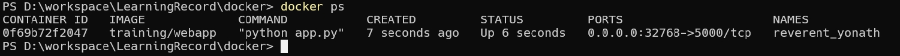
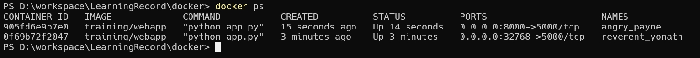
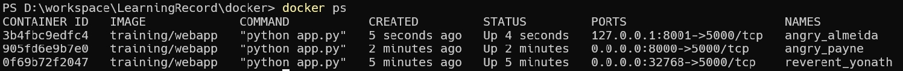
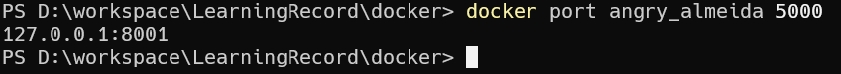
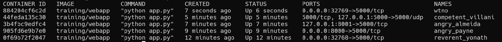
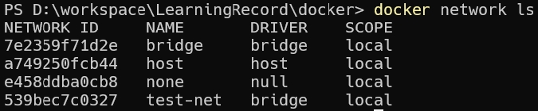
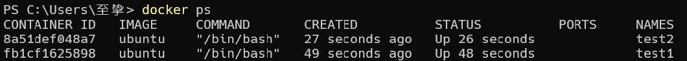
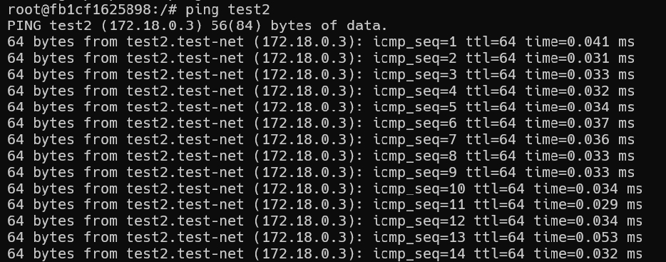
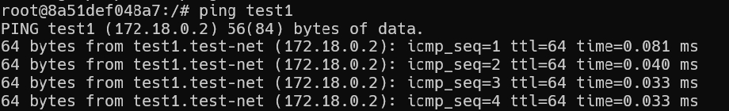

前面我们实现了通过网络端口来访问运行在 docker 容器内的服务。

容器中可以运行一些网络应用，要让外部也可以访问这些应用，可以通过 -P 或 -p 参数来指定端口映射。

下面我们来实现通过端口连接到一个 docker 容器。

## 网络端口映射
我们创建了一个 python 应用的容器。

    docker run -d -P training/webapp python app.py

另外，我们可以指定容器绑定的网络地址，比如绑定 127.0.0.1。

我们使用 `-P` 绑定端口号，使用 `docker ps` 可以看到容器端口 `5000` 绑定主机端口 `32768`。

我们也可以使用 `-p` 标识来指定容器端口绑定到主机端口。

两种方式的区别是:
- `-P` :是容器内部端口随机映射到主机的端口。
- `-p` : 是容器内部端口绑定到指定的主机端口。

比如

    docker run -d -p 8000:5000 training/webapp python app.py

另外，我们可以指定容器绑定的网络地址，比如绑定 127.0.0.1。

    docker run -d -p 127.0.0.1:8001:5000 training/webapp python app.py

这样我们就可以通过访问 `127.0.0.1:8001` 来访问容器的 5000 端口。

上面的例子中，默认都是绑定 tcp 端口，如果要绑定 UDP 端口，可以在端口后面加上 /udp。

    docker run -d -p 127.0.0.1:5000:5000/udp training/webapp python app.py

`docker port` 命令可以让我们快捷地查看端口的绑定情况。

    docker port angry_almeida 5000

## Docker 容器互联
端口映射并不是唯一把 docker 连接到另一个容器的方法。

docker 有一个连接系统允许将多个容器连接在一起，共享连接信息。

docker 连接会创建一个父子关系，其中父容器可以看到子容器的信息。

### 容器命名
当我们创建一个容器的时候，docker 会自动对它进行命名。另外，我们也可以使用 --name 标识来命名容器，例如：

    docker run -d -P --name wtno training/webapp python app.py

我们可以使用 docker ps 命令来查看容器名称。

### 新建网络
下面先创建一个新的 Docker 网络。

    docker network create -d bridge test-net

查看

    docker network ls

参数说明：

- `-d`：参数指定 Docker 网络类型，有 bridge、overlay。

其中 overlay 网络类型用于 Swarm mode，在本小节中你可以忽略它。

### 连接容器
运行一个容器并连接到新建的 test-net 网络:

    docker run -itd --name test1 --network test-net ubuntu /bin/bash

打开新的终端，再运行一个容器并加入到 test-net 网络:

    docker run -itd --name test2 --network test-net ubuntu /bin/bash

下面通过 ping 来证明 test1 容器和 test2 容器建立了互联关系。

如果 test1、test2 容器内中无 ping 命令，则在容器内执行以下命令安装 ping（即学即用：可以在一个容器里安装好，提交容器到镜像，在以新的镜像重新运行以上俩个容器）。

    apt-get update
    apt install iputils-ping

在 test1 容器输入以下命令：

    ping test2

同理在 test2 容器也会成功连接到:

这样，test1 容器和 test2 容器建立了互联关系。

如果你有多个容器之间需要互相连接，推荐使用 Docker Compose，后面会介绍。

## 配置 DNS
我们可以在宿主机的 /etc/docker/daemon.json 文件中增加以下内容来设置全部容器的 DNS：

    {
      "dns" : [
        "114.114.114.114",
        "8.8.8.8"
      ]
    }

设置后，启动容器的 DNS 会自动配置为 114.114.114.114 和 8.8.8.8。

配置完，需要重启 docker 才能生效。

查看容器的 DNS 是否生效可以使用以下命令，它会输出容器的 DNS 信息：

    docker run -it --rm  ubuntu  cat etc/resolv.conf

