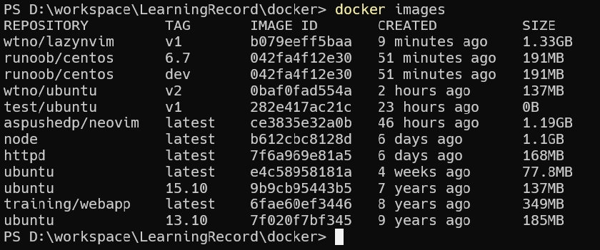

### 使用镜像创建一个容器
     docker run --name neovim -it aspushedp/neovim

### 备份当前 Neovim 文件
    # required
    mv ~/.config/nvim{,.bak}

    # optional but recommended
    mv ~/.local/share/nvim{,.bak}
    mv ~/.local/state/nvim{,.bak}
    mv ~/.cache/nvim{,.bak}

### 克隆启动器
    git clone https://github.com/LazyVim/starter ~/.config/nvim

### 删除该.git文件夹，以便您稍后可以将其添加到您自己的存储库中
    rm -rf ~/.config/nvim/.git

### 启动 Neovim
    nvim

### 退出容器
    exit

### 提交容器副本
    docker commit -m="has update" -a="wtno" 0542acd93b37 wtno/lazynvim:v1

### 启动镜像
    docker run -it wtno/lazynvim:v1

